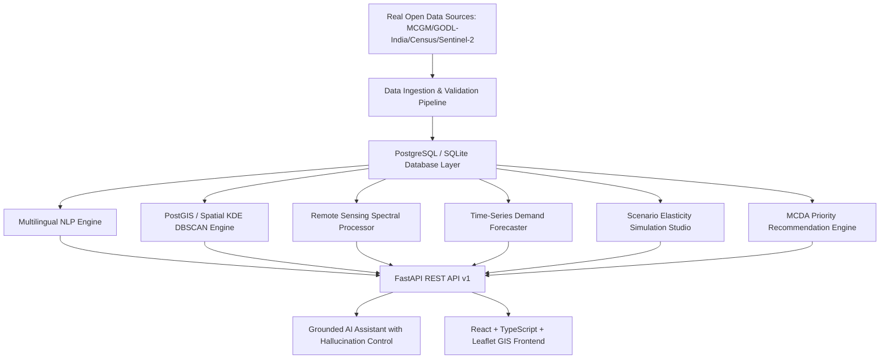

# System Architecture & Technical Specifications

## 1. End-to-End System Pipeline

## 2. Layer-by-Layer Architectural Breakdown

### 2.1 Frontend Client (React 18 + Vite + TypeScript)
- **State & Data Fetching**: TanStack React Query + Typed Fetch Client with Bearer JWT injection.
- **GIS Cartography**: Leaflet + React-Leaflet with custom Dark Matter CartoDB tiles and GeoJSON vector polygons.
- **Visual Analytics**: Recharts responsive SVG components for area charts, pie breakdowns, and horizontal feature importance bars.
- **Design System**: Tailwind CSS with custom municipal slate dark palette, full keyboard accessibility, and status indicators.

### 2.2 Backend Application (FastAPI + Python 3.11/3.13)
- **Authentication**: JWT HS256 tokens with bcrypt password hashing and 4-tier RBAC (`ADMIN`, `PLANNER`, `ANALYST`, `VIEWER`).
- **Database Engine**: SQLAlchemy 2.0 ORM with PostgreSQL/PostGIS support and portable SQLite fallback.
- **Structured Logging**: JSON formatter outputting UTC timestamps, module names, execution latencies, and exception stack traces.

### 2.3 Analytics, ML, & Decision Support Engines
1. **Multilingual NLP**: Language detection, Hinglish normalization dictionary, OneVsRest Multi-Label Logistic Regression, rule-based & gazetteer Named Entity Recognition, and geocoding cache.
2. **Dense Semantic Embeddings**: 64-dimensional SVD vectorizer supporting real-time cosine similarity search across citizen feedback records.
3. **Spatial Clustering**: DBSCAN spatial clustering over Haversine distances to identify density-based municipal grievance hotspots.
4. **Infrastructure Gap Analyzer**: Automated deficit calculation comparing resident population demand against supply norms (135 LPCD water, 0.45 kg/day solid waste, WHO hospital beds, and drainage network length).
5. **Remote Sensing**: Multi-spectral band calculation for NDVI (Vegetation), NDBI (Built-up), and NDWI (Water) from Sentinel-2 MSI surface reflectance.
6. **Predictive Demand Forecaster**: RandomForest lag regressor with recursive 12-month horizon, 95% confidence bounds, and feature importance explanations.
7. **Scenario Studio**: Empirical elasticity simulation of public transport expansion, drainage upgrades, and urban population influx.
8. **Grounded AI Assistant**: RAG engine performing structured database and GIS queries before answering queries, providing verifiable source citations and preventing hallucinations.
