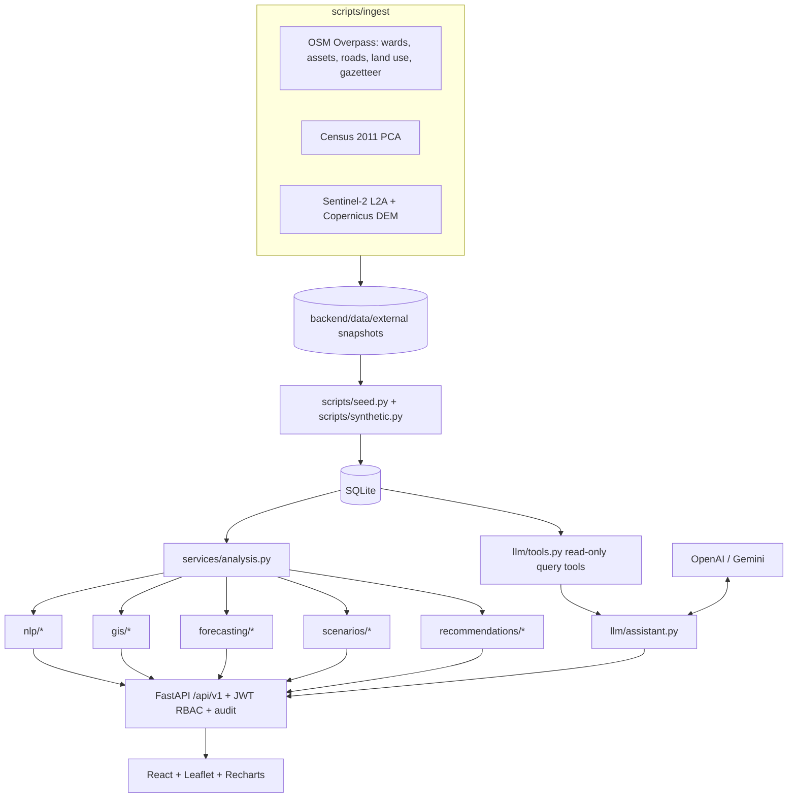

# Architecture

## Layers

| Layer | Responsibility |
|---|---|
| `scripts/ingest` | Fetch and cache open data. Overpass calls retry and fall back across mirrors. Sentinel composites are cached as `.npz` so classification can be re-run offline. |
| `scripts/seed.py` | Deterministic build: wards → demographics → land use → satellite → assets → transport → synthetic series → models → analytics → catalogue. |
| `backend/app/services/analysis.py` | DB-backed analytics shared by the seed and the API "recompute" endpoints (gaps, growth, forecasts, priorities, recommendations, hotspots, scenario baseline, future demand). |
| Pure modules (`nlp`, `gis`, `forecasting`, `scenarios`, `recommendations`, `analytics`) | No database access. Unit-tested in isolation. |
| `llm/` | Provider abstraction, read-only tools that return a citation with the SQL that ran, and a grounded assistant with a rule-based fallback. |
| API | All routes need a JWT. Writes are role-gated (see README). Mutations write `audit_logs`. Satellite overlays are the only public route (static imagery). |

## Key design decisions

- **Provenance everywhere.** Records carry `provenance` (OSM, CENSUS, SENTINEL, DERIVED, ESTIMATED, SYNTHETIC, IMPORTED, CITIZEN), and the UI shows it.
- **No hardcoded outputs.** Dashboard trends, hotspot counts, scenario baselines and forecast histories are all computed from the database.
- **Honest metrics.** The classifier reports both a held-out split and a hand-written gold set. Forecasters are compared with a seasonal-naive baseline.
- **Data confidence.** Gaps measured from incomplete OSM facility counts are flagged `LOW` and down-weighted in MCDA, so missing data isn't mistaken for missing infrastructure.
- **LLM grounding.** The model can only call parameterised read-only tools. Citations come from executed calls, not from generated text.
